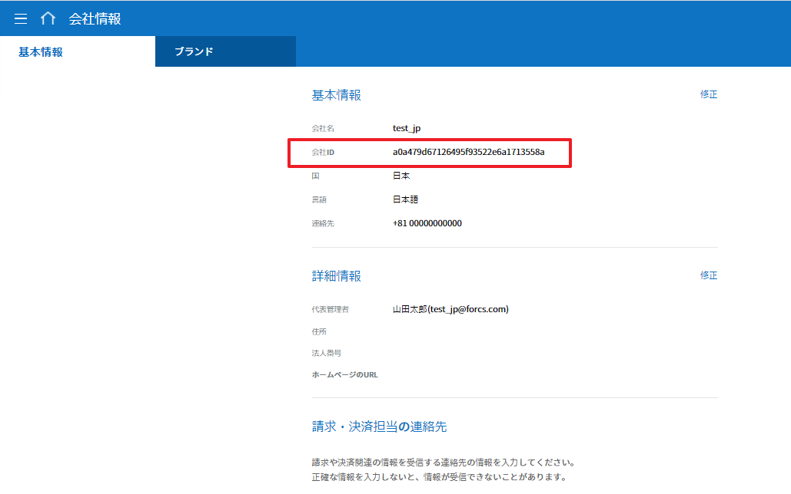

--------------------------
eformsign API の活用
--------------------------

eformsign が提供する API を活用し、eformsign の機能を顧客のシステム/サービスで呼び出して使用できる機能です。

スタート 
=========

eformsign API を使用するためには、次のような準備作業が必要です。

- 会社 ID と 文書 ID の確認
- API キーの作成および暗号化キーの確認
- 署名の登録

.. caution:: 
   
   署名の登録には30秒の時間制限があります。30秒以内に署名を登録し、トークンを取得してください。 

会社 ID と 文書 ID の確認
---------------------------

eformsign API を使用するためには、会社の ID と照会したい文書のIDが必要です。 

eformsign サービスにログインし、会社 ID と文書 ID を確認してください。

.. note:: 

   会社 ID は、左のメニューツリーの会社管理 > 会社情報 メニューの「基本情報」タブで確認することができます。

   |image1|

   文書 ID は、各文書トレイの右上にある文書アイコン(|image2|)をクリックし、文書 ID コラムを追加すると、照会したい文書のIDを確認することができます。 

   |image3|

.. _apikey:

API キーの作成および暗号化キーの確認
----------------------------------------

1. eformsign に代表管理者としてログインし、メニューツリーで**[コネクト] > [API / Webhook]**\に移動します。 

.. image:: resources/apikey1.PNG
    :width: 700
    :alt: コネクト > API/Webhook メニューの位置

2. **[API キー]**タブを選択し、**API キーの作成**\ボタンをクリックします。 

.. image:: resources/apikey2.PNG
    :width: 700
    :alt: API キー登録ボタン

3. API キー作成ポップアップにエイリアスとアプリケーション名を入力し、保存ボタンをクリックします。

.. image:: resources/apikey3.PNG
    :width: 700
    :alt: API キー登録ポップアップ

4. 生成されたキーリストから**キーを表示**\ボタンをクリックし、API キーと暗号化キーを確認できます。

.. image:: resources/apikey4.PNG
    :width: 700
    :alt: API キーを表示 ボタンの位置

.. image:: resources/apikey5.PNG
    :width: 700
    :alt: API キーおよび暗号化キーの確認 

.. note:: **API キーを修正する方法**

    生成されたキーリストから**修正**ボタンをクリックし、エイリアスとアプリケーション名を修正することができます。
  	また、ステータス領域をクリックし、ステータスを活性/非活性に変更することもできます。

.. note:: **API キーを削除する方法**

    生成されたキーリストから**削除**ボタンをクリックし、API キーを削除することができます。

署名の登録 
==============

eformsign_signature は、非対称キー方式と楕円曲線暗号(Elliptic curve cryptography)を使用しています。

.. tip:: 
   
   楕円曲線暗号は、公開キー暗号化方式の一つで、データ暗号化デジタル認証など現在もっとも広く使われている暗号化方式です。 

署名の登録方法については、Java、Python、PHP言語別に分けて説明します。

Java
-------

サーバーの現在時刻を String(UTF-8) に変換し、`API キーの作成 <#apikey>`__\で作成された private key で署名すると、署名したデータを hex string に変換します。

.. note:: 

   署名アルゴリズムは SHA256withECDSA を使用します。

Python
-------

キーフォーマット処理用のライブラリーを使用する必要があります。作業を実行する前に、次のコマンドを実行して ライブラリーをインストールしてください。

.. code:: python

   pip install https://github.com/warner/python-ecdsa/archive/master.zip

PHP
-------

以下の例題の keycheck.inc.php、test.php ファイルを同じパスに保存してから例題を行ってください。

各言語の例題
---------------------

以下は各言語の例題です。

.. note:: 

   execution_time は long タイプを使用しています。そのため、execution_time を入力する際は Access Token 発行の際に確認した時刻の次に L を追加してください。  

.. code-tabs::

    .. code-tab:: java
        :title: Java

        import java.security.KeyFactory;
        import java.security.spec.PKCS8EncodedKeySpec;
        import java.security.PrivateKey;
        import java.security.Signature;
         
        //private key
        String privateKeyHexStr = "取得した private key(String)";    //会社コネクト > API Key の Private key 値を入力
        KeyFactory keyFact = KeyFactory.getInstance("EC");
        PKCS8EncodedKeySpec psks8KeySpec = new PKCS8EncodedKeySpec(new BigInteger(privateKeyHexStr,16).toByteArray());
        PrivateKey privateKey = keyFact.generatePrivate(psks8KeySpec);
         
        //execution_time - サーバーの現在時刻
        //long execution_time = new Date().getTime();
        long execution_time = 1611537340731L;     //Access_token 作成の際に取得した execute_time をこちらに入力。 long タイプのため、作成された時刻の次に L 追加     
        String execution_time_str = String.valueOf(execution_time);
         
        //eformsign_signature 生成
        Signature ecdsa = Signature.getInstance("SHA256withECDSA");
        ecdsa.initSign(privateKey);
        ecdsa.update(execution_time_str.getBytes("UTF-8"));
        String eformsign_signature = new BigInteger(ecdsa.sign()).toString(16);
         
         
        //現在時刻および現在時刻署名値
        System.out.print("execution_time : "+execution_time);
        System.out.print("eformsign_signature : "+eformsign_signature);

    .. code-tab:: python
        :title: Python

        import hashlib
        import binascii
         
        from time import time
        from ecdsa import SigningKey, VerifyingKey, BadSignatureError
        from ecdsa.util import sigencode_der, sigdecode_der
         
        # private key
        privateKeyHex = "取得した private key(String)"
        privateKey = SigningKey.from_der(binascii.unhexlify(privateKeyHex))
         
        # execution_time - サーバーの現在時刻
        execution_time = int(time() * 1000)
          
        # eformsign_signature 生成
        eformsign_signature = privateKey.sign(execution_time.encode('utf-8'), hashfunc=hashlib.sha256, sigencode=sigencode_der)
          
        # 現在時刻および現在時刻署名値
        print("execution_time : " + execution_time)
        print("eformsign_signature : " + binascii.hexlify(signature).decode('utf-8'))

    .. code-tab:: php
        :title: PHP - keycheck.inc.php

        <?php
        namespace eformsignECDSA;
  
        class PublicKey
        {
          
            function __construct($str)
            {
                $pem_data = base64_encode(hex2bin($str));
                $offset = 0;
                $pem = "-----BEGIN PUBLIC KEY-----\n";
                while ($offset < strlen($pem_data)) {
                    $pem = $pem . substr($pem_data, $offset, 64) . "\n";
                    $offset = $offset + 64;
                }
                $pem = $pem . "-----END PUBLIC KEY-----\n";
                $this->openSslPublicKey = openssl_get_publickey($pem);
            }
        }
        function getNowMillisecond()
        {
          list($microtime,$timestamp) = explode(' ',microtime());
          $time = $timestamp.substr($microtime, 2, 3);
          
          return $time;
        }
         
         
        function Sign($message, $privateKey)
        {
            openssl_sign($message, $signature, $privateKey->openSslPrivateKey, OPENSSL_ALGO_SHA256);
            return $signature;
        }
        ?>

    .. code-tab:: php
        :title: PHP - test.php

        <?php
        require_once __DIR__ . '/keycheck.inc.php';
 
        use eformsignECDSA\PrivateKey;
         
         
        define('PRIVATE_KEY', '取得した private key(String)');
         
         
        //private key 設定
        $privateKey = new PrivateKey(PRIVATE_KEY);
         
         
        //execution_time - サーバーの現在時刻
        $execution_time = eformsignECDSA\getNowMillisecond();
         
         
        //eformsign_signature 生成
        $signature = eformsignECDSA\Sign(execution_time, $privateKey);
         
         
        //現在時刻および現在時刻の署名値
        print 'execution_time : ' . execution_time . PHP_EOL;
        print 'eformsign_signature : ' . bin2hex($signature) . PHP_EOL;
        ?>

API 提供リスト
======================

eformsign API は、署名を生成するための API と文書の作成や処理のための API からなります。

署名を生成するための API
-------------------------

署名を生成するために、まず `Access Token API <https://app.swaggerhub.com/apis/eformsign_api/eformsign_API_2.0/2.0_auth>`_\を活用してください。 

``POST``: `/api_auth/access_token <https://app.swaggerhub.com/apis/eformsign_api/eformsign_API_2.0/2.0_auth#/eformsign/post-api_auth-access_token>`_\  Access Token 発行

Access Token API についての詳しい説明は 
`以下 <https://app.swaggerhub.com/apis/eformsign_api/eformsign_API_2.0/2.0_auth>`__\ で確認することができます。

.. caution:: 
   
   署名の生成には30秒の時間制限があります。30秒以内に署名を登録し、トークンを作成する必要があります。 
   また、サーバー上の時間と現在時刻が一致しない場合があります。Access Token API を呼び出し、受信した応答メッセージの"execution_time"\を確認してください。

   .. code:: JSON

      { "code": "4000002", "ErrorMessage": "The validation time has expired.",     "execution_time": 1611538409405 }

   `次 <https://app.swaggerhub.com/apis/eformsign_api/eformsign_API_2.0/2.0_auth>`__\ の例題の位置にも"execution_time"\を入力してください。
   
   |image5| 

   Access Token は、メンバーの権限に応じて登録することができます。メンバーに対する Access Token を登録するためには、以下のように "execution_time" と一緒に "member_id" を入力してください。 
   
   |image6| 

   その後、取得したAPIを実行すると、Access Token が発行され、次のようなタイプの応答を受信することができます。

   .. code:: JSON

      { "api_key": { "name": "アプリケーション_", "alias": "テスト用", "company": { "company_id": "dec5418e58694d90a65d6c38e3d226db", "name": "サンプルデモ", "api_url": "https://kr-api.eformsign.com" } }, "oauth_token": { "expires_in": 3600, "token_type": "JWT", "refresh_token": "8fd0a3c1-44dc-4a03-96ad-01fa34cd159c", "access_token": "eyJhbGciOiJSUzI1NiJ9.eyJpc3MiOiJlZm9ybXNpZ24uaWFtIiwiY29udGV4dCI6eyJjbGllbnRJZCI6IjY4MDk0ZWVhMjVhZjRhNjI5ZTI4ZGU5Y2ZlYzRlYmZjIiwiY2xpZW50S2V5IjoiZTNiM2IzZTUtMGEzMS00NTE1LWE5NzEtN2M4Y2FlNDI4NzZmIiwibWFuYWdlbWVudElkIjoiMzRhYWI4MDBjMmEwNDQwNThmZDRlZjc5OGFlY2RlY2EiLCJzY29wZXMiOiJzbWFydF9lZm9ybV9zY29wZSIsInR5cGUiOiJ1c2VyIiwidXNlck5hbWUiOiIzMmIzZDRmOC00MjdkLTRjZjQtOTZiYS1mYzAxNjIxNWRkNDciLCJ1c2VySWQiOiJhNTEyNGVkNmU2M2Y0OTMzOGJlOTA0MjVhNjFkYjlmNSIsInJlZnJlc2hUb2tlbiI6IjhmZDBhM2MxLTQ0ZGMtNGEwMy05NmFkLTAxZmEzNGNkMTU5YyJ9LCJjbGFpbSI6eyJjb21wYW55X2lkIjoiZGVjNTQxOGU1ODY5NGQ5MGE2NWQ2YzM4ZTNkMjI2ZGIiLCJhY2Nlc3Nfa2V5IjoiMzJiM2Q0ZjgtNDI3ZC00Y2Y0LTk2YmEtZmMwMTYyMTVkZDQ3In0sImV4cCI6MTYxMTU0MjIzNiwiaWF0IjoxNjExNTM4NjM2fQ.BltoXXBSabjXfpyLsZik9OZTE5XtLqe9lguMmJ_qfwZN1NyoVoxDqA5y1-_TLis7FvvNjfI1eegOroCZDZPFyXRaBxAj0CW8TijVjbhliJBuccHFyKXaJxmo_GMmTHYtxNNB1SUgLeFIrYROnpQndU8J7ZkfPDgYGwh1YSx-5s4" } }

.. caution:: 
   
   取得した API キーは、 `次 <https://app.swaggerhub.com/apis/eformsign_api/eformsign_API_2.0/2.0_auth>`__\ の位置にある **Authorize** ボタン（|image4|） をクリックして登録してください。ただし、API キー値には**必ず Base64**\でエンコードした 文字列を入力する必要があります。https://www.base64encode.org/ に接続し、取得した API キーを入力してエンコードされたテキストに変換して入力してください。

文書の作成および処理のための API
----------------------------------

署名を登録すると、次の文書 API を使用して文書の新規作成や文書情報の照会ができ、完了文書ファイル（文書 PDF、監査証跡証明書）や添付ファイルをダウンロードすることができます。 

.. note:: 

   文書 API を使用するためには、先に Access Token の発行が必要です。

現在提供している `文書 API <https://app.swaggerhub.com/apis/eformsign_api/eformsign_API_2.0/2.0_general>`_\は以下のとおりです。

``POST``: `/api_auth/refresh_token <https://app.swaggerhub.com/apis/eformsign_api/eformsign_API_2.0/2.0_general#/eformsign/post-api_auth-refresh_token>`_\  Access Token 更新

``POST``: `/api/documents <https://app.swaggerhub.com/apis/eformsign_api/eformsign_API_2.0/2.0_general#/eformsign/post-api-documents>`_\  文書の新規作成（内部メンバー）

``POST``: `/api/documents/external <https://app.swaggerhub.com/apis/eformsign_api/eformsign_API_2.0/2.0_general#/eformsign/post-api-documents-external>`_\  文書の新規作成（外部受信者）

``GET``: `/api/documents/{document_id} <https://app.swaggerhub.com/apis/eformsign_api/eformsign_API_2.0/2.0_general#/eformsign/get-api-documents-DOCUMENT_ID>`_\  文書情報の照会

``GET``: `/api/docuemnts/{document_id}/download_files <https://app.swaggerhub.com/apis/eformsign_api/eformsign_API_2.0/2.0_general#/eformsign/get-api-documents-DOCUMENT_ID-download_files>`_\  文書ファイルのダウンロード（文書 PDF、 監査証跡証明書）

``GET``: `/api/doduments/{document_id}/download_attach_files <https://app.swaggerhub.com/apis/eformsign_api/eformsign_API_2.0/2.0_general#/eformsign/get-api-documents-DOCUMENT_ID-download_attach_files>`_\  添付ファイルのダウンロード

各 eformsign 文書 API についての詳しい説明は 
`次 <https://app.swaggerhub.com/apis/eformsign_api/eformsign_API_2.0/2.0_general>`__\ をご覧ください。

API 関連情報
===================

API ステータスコード
---------------------

API ステータスコードは、以下の通りです。

200
'''''''

===========  ===============  ===================================
Code         説明              備考
===========  ===============  ===================================
200          成功              成功
===========  ===============  ===================================

202
'''''''

===========  ===============  =====================================================================================
Code         説明              備考
===========  ===============  =====================================================================================
2020001      PDF 生成中       - PDF ファイルとしてダウンロードする際、非同期で生成されるため、文書保存後に PDF 生成まで時間が所要 
                              - 数秒から数分後数分後に再要請するとダウンロード可能
===========  ===============  =====================================================================================

400
'''''''

===========  ===================  ===========================================================
Code         説明                  備考
===========  ===================  ===========================================================
4000001      必須入力値漏れ         API の必須入力値（ヘッダー値またはパラメーター）が入力されていない場合                        
4000002      時間切れ              API 認証の要請時間が時間切れとなった場合
4000003      API キーが存在しない     削除されたAPI キーまたは入力ミスの場合
4000004      文書が存在しない        間違った文書 ID を入力した場合
===========  ===================  ===========================================================

403
'''''''

===========  =========================  ==========================================
Code         説明                        備考
===========  =========================  ==========================================
4030002      Access Token 認証エラー       Access Tokenが正しくない場合
4030003      Refresh Token 認証エラー      Refresh Tokenが正しくない場合
4030004      署名値検証エラー               署名値が正しくない場合
4030005      サポートしない API              サポートしないAPIを呼び出した場合
===========  =========================  ==========================================

405
'''''''

===========  =====================  ===================================
Code         説明                    備考
===========  =====================  ===================================
4050001      サポートしないmethod        サポートしないmethodを呼び出した場合
===========  =====================  ===================================

500
'''''''

===================  ===============  ===================================
Code                 説明              備考
===================  ===============  ===================================
5000001~5000003      サーバーエラー         サーバーエラーが発生した場合
===================  ===============  ===================================

Step タイプ
--------------

===========  ===============  ===================================
Type         Code             説明
===========  ===============  ===================================
Start         00               スタート段階
Complete      01               完了段階
Approval      02               決裁段階
External      03               外部受信者段階
Accept        04               内部受信者段階
===========  ===============  ===================================

User タイプ
--------------

================  ===============  ===================================
Type               Code             説明
================  ===============  ===================================
内部メンバー          01               内部メンバーである場合
外部受信者          02               内部メンバーではなく、外部受信者である場合
================  ===============  ===================================

Status タイプ
--------------

======================  ===============  ===================================
Type                     Code             説明
======================  ===============  ===================================
doc_tempsave             001              下書き（作成者が下書き保存した状態）
doc_create               002              作成
doc_complete             003              完了
doc_update               043              修正
doc_request_delete       047              削除要請
doc_delete               049              削除
doc_request_revoke       040              キャンセル要請
doc_revoke               041              キャンセル
doc_request_reject       045              返戻要請
doc_request_approval     010              決裁要請
doc_accept_approval      012              決裁承認
doc_reject_approval      011              決裁返戻
doc_cancel               013              決裁キャンセル
doc_request_reception    020              内部メンバー要請
doc_accept_reception     022              内部メンバー承認
doc_reject_reception     021              内部メンバー返戻
doc_request_outsider     030              外部受信者要請
doc_accept_outsider      032              外部受信者承認
doc_reject_outsider      031              外部受信者返戻
======================  ===============  ===================================

Action タイプ
--------------

======================  ===============  ===================================
Type                     Code             説明
======================  ===============  ===================================
doc_tempsave             001              下書き保存
doc_create               002              文書 生成
doc_complete             003              完了
doc_request_approval     010              決裁要請
doc_reject_approval      011              決裁返戻
doc_accept_approval      012              決裁承認
doc_cancel               013              決裁キャンセル
doc_request_reception    020              内部メンバー要請
doc_reject_reception     021              内部メンバー返戻
doc_accept_reception     022              内部メンバー承認
doc_accept_tempsave      023              内部メンバーが下書きとして保存
doc_request_outsider     030              外部受信者要請
doc_reject_outsider      031              外部受信者返戻
doc_accept_outsider      032              外部受信者承認
doc_rerequest_outsider   033              外部受信者再要請
doc_open_outsider        034              外部受信者閲覧
doc_outsider_tempsave    035              外部受信者が下書きとして保存
doc_request_revoke       040              キャンセル要請
doc_refuse_revoke        041              キャンセル要請返戻拒否
doc_revoke               042              キャンセル
doc_update               043              修正
doc_cancel_update        044              修正キャンセル
doc_request_reject       045              返戻要請
doc_refuse_reject        046              返戻要請返戻
doc_request_delete       047              削除要請
doc_refuse_delete        048              削除要請返戻
doc_delete               049              削除
doc_complete_send_pdf    050              完了文書をPDFとして送信
doc_transfer             051              移管
======================  ===============  ===================================

.. |image2| image:: resources/column_icon.png
   :width: 45px
.. |image3| image:: resources/document_id.png
.. |image4| image:: resources/authorize_icon.png
   :width: 60px
.. |image5| image:: resources/execution_time.png
   :width: 450px
.. |image6| image:: resources/execution_time2.png
   :width: 450px