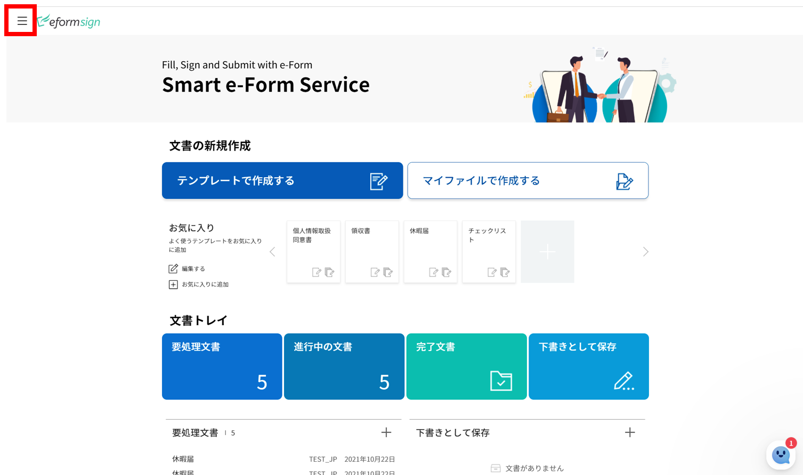
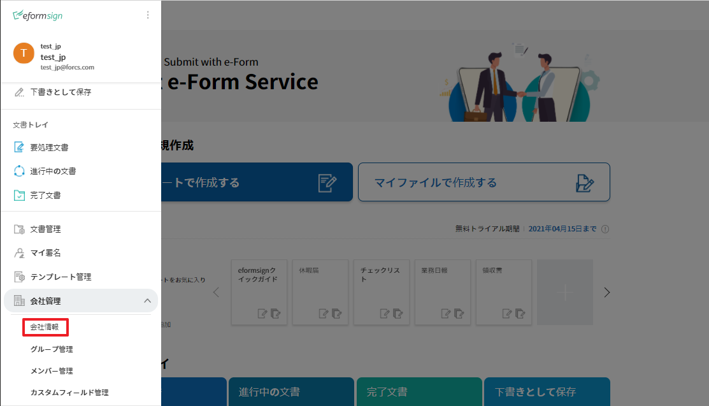
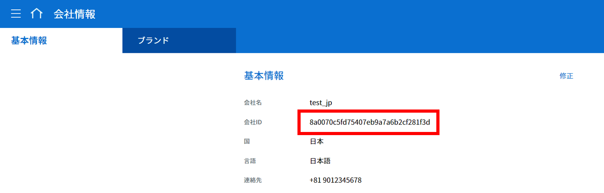
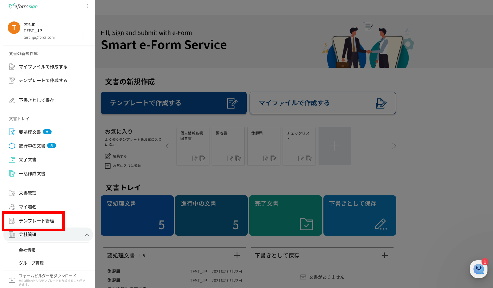
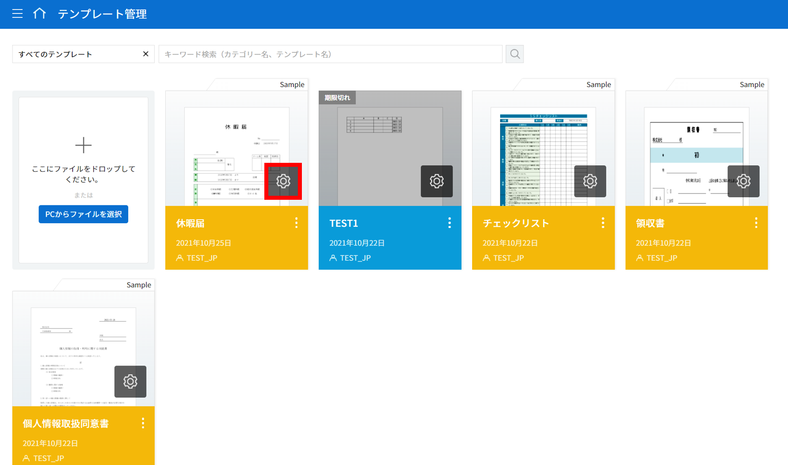
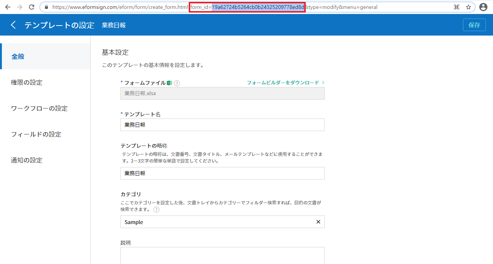

======================================
eformsign機能の組み込み
======================================

eformsign機能を組み込み連動すれば、顧客が提供しているサービス（もしくはサイト）内ユーザー（エンドユーザー）がeformsignサービスサイトを介さずともeformsignの電子帳票を利用することができます。
例えるなら、本人のブログで特定のYouTube動画を紹介したい場合に、ブログにYouTube動画を挿入するのに似ています。

------------------
始めてみましょう
------------------

eformsign embedding 機能を利用するためには、会社IDとテンプレートIDが必要です。

会社IDの確認
========================

会社管理 > 会社情報 > 基本情報 から会社IDを確認することができます。

eformsignのメインメニュー
-------------------------

会社情報メニュー
--------------------------------

会社情報 > 基本情報
-------------------------

テンプレートIDの確認
===========================

テンプレート管理メニューに移動し、使用したいテンプレートの設定アイコンをクリックすると、そのテンプレートのURLからテンプレートIDを確認することができます。 

テンプレート管理メニュー
-----------------------------------

テンプレート管理画面
---------------------------------

テンプレートIDの場所
-------------------------

---------------
インストール
---------------

eformsignの機能を利用したいWebページに、次のスクリプトを追加します。

.. code-block:: javascript

   //jquery
   <script src="https://www.eformsign.com/plugins/jquery/jquery.min.js"/>
   //eformsign embedded script
   <script src="https://www.eformsign.com/lib/js/efs_embedded_v2.js"/>
   //eformsign redirect script
   <script src="https://www.eformsign.com/lib/js/efs_redirect_v2.js"/>

.. note::

   eformsign機能を組み込みたいページに上記のスクリプトを追加すると、eformsign のオブジェクトをグローバル変数として使用することができます。

------------------------------------------
eformsignのオブジェクトについての情報
------------------------------------------

eformsignのオブジェクトは、embeddingとredirectの2つのタイプで構成されています。

+----------+-----------------------+--------------------------------------+
| Type     | Name                  | Description                          |
+==========+=======================+======================================+
| embedding| eformsign.document    | eformsignを組み込んで文書を作成      |
|          | (document_option,     | できるようにする関数                 |
|          | iframe_id,            |                                      |
|          | success_callback,     | callbackパラメータはオプション       |
|          | error_callback)       |                                      |
|          |                       | -  document_option, iframe_id: 必須  |
|          |                       |                                      |
|          |                       | -  success_callback: オプション      |
|          |                       |                                      |
|          |                       | -  error_callback: オプション        |
+----------+-----------------------+--------------------------------------+
| redirect | eformsign.document    | eformsignへのページ転換で            |
|          | (document_option)     | 文書を作成できるようにする関数       |
|          |                       |                                      |
|          |                       | -  document_option : 必須            |
+----------+-----------------------+--------------------------------------+

１．EformSignDocument.document関数
============================================

.. note::

   関数タイプ
   document(document_option, iframe_id, success_callback , error_callback)

eformsignを組み込み、顧客のサイト/サービスで文書を作成・検討・プレビューできるようにする関数です。
EformSignDocument.documentは、組み込む文書の詳細オプションを設定する関数です。

document_optionとcallbackの2つのパラメータを使用することができます。

===================  ===============  ==========  ==========================================================
 Parameter Name       Parameter Type   必須入力      説明 
===================  ===============  ==========  ==========================================================
 document_option      Json             必須         eformsignを組み込んで起動する会社、ユーザー、文書などのオプションを指定 
 iframe_id            String           必須         eformsignが組み込まれて表示されるiframe id 
 success_callback     Function         非必須       eformsignによる文書作成が成功した際呼び出されるcallback関数
 error_callback       Function         非必須       eformsignによる文書作成が失敗した際呼び出されるcallback関数
===================  ===============  ==========  ==========================================================

.. code-block:: javascript

     var eformsign = new EformSign();

    var document_option = {
       "company" : {
          "id" : "",            // company idを入力
          "country_code" : "",  // 国コードを入力 (例: kr)
          "user_key": ""        // 顧客側のシステムにログインしたユーザーのunique key. ブラウザクッキーのeformsignログイン情報との比較に使用
       },
       "user" : {
            "type" : "01" ,         // ユーザーの区分 (01: メンバー、02: 外部者)
            "id": "test1@forcs.com" // ユーザーID（メールアドレス）
            "access_token" : "",    // Access Tokenの入力（OpenAPI Access Token参照）
            "refresh_token" : "",   // Refresh Tokenの入力（OpenAPI Access Token参照）
            "external_token" : "",  // 外部者が処理する際、ユーザーを認証するExternal Tokenを入力（Webhookから提供）
            "external_user_info" : {
               "name" : ""          // 外部者が処理する際、外部者の名前を入力

            }
        },
        "mode" : {
            "type" : "02",      // モード (01: 文書の新規作成、02: 文書の検討、03: 文書のプレビュー)
            "template_id" : "", // template idの入力
            "document_id" : ""  // document_idの入力
        },
        "layout" : {
            "lang_code" : "ko" // eformsignの言語 ko, en, ja
        },
        "prefill" : {
            "document_name": "", // 文書タイトルの入力
            "fields": [
                {
                    "id" ; "顧客名",       // フィールド名
                    "value" : "田中太郎",    // フィールド値
                    "enabled" : true,   // 活性化
                    "required" : true   // 必須
                }
            ],
            "recipients": [
                {
                    "step_idx" : "2",       // ワークフローの順番。受信者がいる場合は２からスタート
                    "step_type": "06",      // ステップの種類 05: 参加者、06: 検討者
                    "name" : '田中太郎',        // 受信者の名前
                    "id": "test@forcs.com", // 受信者ID/アドレス
                    "sms": "01023456789",   // 受信者の携帯電話番号
                    "use_mail": true,       // メール通知の使用
                    "use_sms": true,        // SMS通知の使用
                    "auth": {
                        "password": "",     // ワークフロー設定で文書のプレービュー前に本人確認の設定 - 本人確認情報にチェックした場合パスワードを入力
                        "password_hint": "",// 上記条件に従ってパスワードを入力する際、表示されるパスワードのヒント
                        "valid": {
                            "day": 7,       // 文書の送信期限 (日)
                            "hour": 0       // 文書の送信期限 (時間)
                        }
                    }
                }
            ],
            "comment": "こちらにコメントを入力"     // メッセージ
        },
        "return_fields" : ['顧客名']           // Success Callbackで値を確認するためのフィールド名
    };
     
    //callback option
    var success_callback = function(response){ 
        console.log(response.code); 
        if( response.code == "-1"){
            //文書作成の成功
            console.log(response.document_id);
            // return_fieldsに渡したデータの表示が可能。 fieldsはフォームを作成する際の入力コンポーネントのIDに当たる。
            console.log(response.field_values["company_name"]);
            console.log(response.field_values["position"]);
        }
    };
     
    var error_callback = function(response){
        console.log(response.code); 
        //文書作成の失敗
        alert(response.message);
    };
     
    eformsign.document(document_option, "eformsign_iframe", success_callback, error_callback);
    eformsign.open();

２．EformSignDocument.open関数
=============================================

文書の組み込みを開始する関数です。

EformSignDocument.document関数で文書オプションを設定した後、EformSignDocument.openを実行してください。

.. code-block:: javascript

    var eformsign = new EformSignDocument();
    //中略
    eformsign.document(document_option, "eformsign_iframe", success_callback, error_callback, action_callback);
    eformsign.open();

+++++++++++++++++++++++++++++++++++++++++++++++++++++++++++++++++++++++++++++++++++++++++++++++++++++++++++++++++++

document-optionパラメータ
=======================================

document-optionでは以下6つの項目を設定することができます。 

===============  ==================  ==============  =====  ================================================================================
 変数名           説明                データタイプ   必須    下位オプション 
===============  ==================  ==============  =====  ================================================================================
 company          会社情報             Object        O      id, country_code, user_key
 mode             組み込みモード         Object        O      type, template_id, document_id
 user             ユーザー情報           Object        X      type, id, access_token, refresh_token, external_token, external_user_info
 layout           レイアウト             Object        X       lang_code
 prefill          自動記入             Object        X       document_name, fields, recipients, comment
 return_fields    returnフィールド       Array         X     
===============  ==================  ==============  =====  ================================================================================

.. note::

   会社情報とモードは入力必須項目です。 

１．company(会社情報/必須)
-------------------------------------

===============  ==============================  =============  =======  =================================================================================================================
 変数名           説明                           データタイプ     必須      備考 
===============  ==============================  =============  =======  =================================================================================================================
 id               会社ID                           String          O        会社管理 - 会社情報から確認

 country_code     国コード                         String          X        会社管理 - 会社情報の国コードを指定。任意入力項目だが、入力後即open可能

 user_key         顧客システムユーザー固有キー       String          X        組み込みをする顧客のシステム上で、対象のユーザーが誰かを明らかにするため、eformsignに渡すユーザーのアカウント情報

                                                                           ブラウザに既にログイン情報がある場合、対象のkeyと比較を行う。ログイン情報と対象のkeyが一致しない場合、自動的にログアウトされる。

===============  ==============================  =============  =======  =================================================================================================================

.. code-block:: javascript

   var document_option = {
         "company" : {
             "id" : 'f9aec832efef4133a1e849efaf8a9aed',
             "country_code" : "kr",
             "user_key": "eformsign@forcs.com"
         }
    };

２．mode(組み込みモード/必須)
========================================

===============  ================  ==============  =====  ==================================================
 変数名           説明              データタイプ   必須    備考 
===============  ================  ==============  =====  ==================================================
 type             機能タイプ         String        O      01: 文書作成、02: 文書検討、03: プレビュー
 template_id      テンプレートID       String       X      
 document_id      文書ID            String          X      文書検討, プレビュー時必須
===============  ================  ==============  =====  ==================================================

**テンプレートを利用した新規作成** 

- テンプレートを利用して文書を新規作成します。

.. code-block:: javascript

    var document_option = {
        "mode" : {
        "type" : "01" ,  // 01 : 文書作成、02 : 文書検討、03 : プレビュー
        "template_id" : "" // template idを入力
        }
    }

**受信した文書に追記** 
    

- 受信した文書に追記します。 

.. code-block:: javascript

    var document_option = {
        "mode" : {
        "type" : "02" ,  // 01 : 文書作成、02 : 文書検討、03 : プレビュー
        "template_id" : "a2c6ed9df9b642f2ade43c7efe58c9a3", // template idの入力
        "document_id" : "5c19ff8c703f401c968236837d701e92"  // document_idの入力
      }
    }

**特定の文書をプレビュー**

- 作成した文書のプレビューを確認します。

.. code-block:: javascript

    var document_option = {
        "mode" : {
        "type" : "03" ,  // 01 : 文書作成、02 : 文書検討、03 : プレビュー
        "template_id" : "a2c6ed9df9b642f2ade43c7efe58c9a3", // template idの入力
        "document_id" : "5c19ff8c703f401c968236837d701e92"  // document_idの入力
      }
    }

３．user（ユーザー情報/任意）
========================================

=========================  ==============================  =============  =======  ==========================================================================
 変数名                     説明                            データタイプ    必須     備考 
=========================  ==============================  =============  =======  ==========================================================================
 type                       ユーザータイプ                  String         O        01: 会社メンバー、02: 外部作成者
 id                         アカウント（メールアドレス）       String         X        ユーザーID/メールアドレスの入力
 access_token               Access Token                    String         X        Open API > Access Token 発行参照
 refresh_token              Refresh Token                   String         X        Open API > Access Token 発行参照
 external_token             外部者処理用トークン            String         X        メンバーではないユーザーが受信した文書を検討する際、必須入力（Webhookから提供）
 external_user_info         外部作成者の情報                String         X        メンバーではないユーザーが受信した文書を作成及び検討する際、必須入力
 external_user_info.name    外部作成者の名前                String         X        メンバーではないユーザーが受信した文書を作成及び検討する際、必須入力
=========================  ==============================  =============  =======  ==========================================================================

**会社のメンバーのログインによる文書の作成及び検討**

- ユーザー情報を指定していない場合に該当します。	
- eformsignのログインページが起動し、ログイン後に文書を作成できます。

**会社のメンバーのログインによる文書の作成及び検討（IDの事前入力)**   

- eformsignのログインページが起動し、ログイン後に文書を作成できます。このとき、事前入力したIDがログイン画面に表示されます。

.. code-block:: javascript

    var document_option = {
        "user":{
            "type" : "01",
            "access_token" : "eyJhbGciOiJSUzI1NiJ9.eyJpc3MiOiJlZ...",
            "refresh_token" : "0161ac6c-0f47-4cc3-9301-381f57c41495"
        }
    };

**会社のメンバーのトークンを利用した作成及び検討**

- eformsignにログインせず、特定のアカウントのトークンを使用して文書の作成及び受信した文書を検討・作成することができます。
- トークンは、Open APIのAccess tokenで発行可能です。

.. code-block:: javascript

    var document_option = {
        "user":{
            "type" : "01",
            "access_token" : "eyJhbGciOiJSUzI1NiJ9.eyJpc3MiOiJlZ...",
            "refresh_token" : "0161ac6c-0f47-4cc3-9301-381f57c41495"
        }
    };

**メンバーではないユーザーが文書を新規作成**  

- eformsignの会員ではないユーザーが文書を作成できます。

.. code-block:: javascript

    var document_option = {
        "user":{
            "type" : "02",
            "external_user_info" : {
               "name" : "田中太郎"
            }
        }
    };

**メンバーではないユーザーが受信した文書を検討・作成**
    
- eformsignのメンバーではないユーザーが、受信した文書を検討・作成できます。

.. code-block:: javascript 

    var document_option = {
        "user":{
            "type" : "02",
            "external_token" : "f8e2ff29114445dcac1e2889ac2f8a5e",
            "external_user_info" : {
                "name" : "田中太郎"
            }
        }
    };

４．layout(レイアウト/任意)
========================================

===============  ===============  ==============  =====  ==================================================
 変数名           説明             データタイプ    必須    備考 
===============  ===============  ==============  =====  ==================================================
 lang_code        eformsign言語    String          X      ko: 韓国語、en: 英語、ja: 日本語
===============  ===============  ==============  =====  ==================================================

.. code-block:: javascript

    var document_option = {
        "layout" : {
              "lang_code" : "ko"
        }
    }

５．prefill(自動入力/任意)
========================================

文書の作成中に自動でされる情報を設定します。

=================================  ==============================  =============  ======  ===========================================================================================
 変数名                             説明                            データタイプ   必須     備考 
=================================  ==============================  =============  ======  ===========================================================================================
document_name                      文書タイトル                        String         X   
fields                             フィールドリスト                    Array          X       フィールド設定Objectのリスト
fields[].id                        フィールド名                      String         X      フィールド設定Object内では必須（フィールド名基に設定適用)
fields[].value                     フィールド値                      String         X       - 設定しない場合、または新規作成の場合はテンプレートのフィールド設定オプションに基づく
                                                                                          - 設定する場合、優先順位はテンプレートのフィールド設定よりも高くなる。
                                                                                          
fields[].enabled                   フィールド活性化                  Boolean        X       - 設定しない場合、テンプレート設定の項目制御オプションに基づく

                                                                                          - 設定する場合、優先順位はテンプレートの項目制御オプションよりも高くなる。

fields[].required                  フィールド必須                    Boolean        X      - 設定しない場合、テンプレート設定の項目制御オプションに基づく

                                                                                          - 設定する場合、優先順位はテンプレートの項目制御オプションよりも高くなる。
recipients                         受信者リスト                        Array          X        受信者情報Objectのリスト
recipients[].step_idx              ワークフローの順番                  String         X        １人目の受信者: "2"、2人目以降の受信者: 順番に沿って1ずつ増加

recipients[].step_type             受信者の種類                       String         X      - 既存のワークフロー: "01"（完了）、"02"（決裁）、"03"（外部受信者）、"04"(内部受信者)

                                                                                          - 新規ワークフロー: "01"（完了）、"05"（参加者）、"06"（検討者）

                                                                                            recipients内、それぞれのObjectに設定必須

recipients[].name                  受信者の名前                       String         X 
recipients[].id                    アカウント（メールアドレス）      String         X       - 会社のメンバーのアカウント情報（ID/メールアドレス）の入力
                                                                                            - step_typeが05（参加者）もしくは06（検討者）である場合、メンバーではなくてもメールアドレスの入力が可能
recipients[].sms                   携帯番号                           String        X   
recipients[].use_mail              メール送信                         Boolean        X   
recipients[].use_sms               SMS送信                          Boolean        X   
recipients[].auth                  本人確認及び                      Object         X   
                                    文書の送信期限情報
recipients[].auth.password         本人確認情報（パスワード）         String         X        ワークフローの設定における本人確認を設定 - 本人確認情報にチェックを入れた場合、パスワードを入力
recipients[].auth.password_hint    本人確認情報のヘルプ             String         X        上記条件に従ってパスワードを入力する際、表示されるパスワードのヒント
recipients[].auth.valid            文書の送信期限情報               Object          X        未入力時の初期値: 0日0時間（メンバーである場合は無制限、外部受信者の場合は画面上再入力が必要）
recipients[].auth.valid.day        文書の送信期限（日）             Integer         X   
recipients[].auth.valid.hour       文書の送信期限（時間）           Integer         X   
comment                            次の受信者に伝えるメッセージ      String          X   
=================================  ==============================  =============  ======  ===========================================================================================

.. code-block:: javascript

    var document_option = {
        "prefill" : {
            "document_name": "個人情報取扱同意書"、   // 文書タイトルの入力
            "fields": [
                {
                    "id" ; "顧客名"、       // フィールド名
                    "value" : "田中太郎",    // フィールド値
                    "enabled" : true,   // 活性化
                    "required" : true   // 必須
                }
            ],
            "recipients": [
                {
                    "step_idx" : "2",       // ワークフローの順番。受信者がいる場合２からスタート
                    "step_type": "06",      // ステップの種類。 05: 参加者、06: 検討者
                    "name" : "田中太郎",        // 受信者の名前
                    "id": "test@forcs.com", // 受信者のID/メールアドレス
                    "sms": "01023456789",   // 受信者の携帯電話番号
                    "use_mail": true,       // メール通知の使用
                    "use_sms": true,        // SMS通知の使用
                    "auth": {
                        "password": "6789", // ワークフローの設定における本人確認を設定 - 本人確認情報にチェックを入れた場合、パスワードを入力
                        "password_hint": "携帯番号の下3桁を入力してください。"、// 上記条件に従ってパスワードを入力する際、表示されるパスワードのヒント
                        "valid": {
                            "day": 7,       // 文書の送信期限（日）
                            "hour": 0       // 文書の送信期限（時間）
                        }
                    }
                }
            ],
            "comment": "確認及び署名をお願いします。"  // メッセージ
        }
    };

６．リターンフィールド（任意）
--------------------------------------

文書の作成及び修正後、ユーザーが作成したフィールドの内容のうちcallback関数でリターンする項目を設定します。
    
.. note::

   設定しない場合、基本フィールドの情報のみリターンします。詳しい情報は callBackパラメータをご参照ください。

.. code-block:: javascript

    var document_option = {
       "return_fields" : ['顧客名']
    }

-------------------------------
Callbackパラメータ
-------------------------------

１．response
========================================

文書の作成・検討に成功または失敗した際、次のようにresponseが返ってきます。

=================================  =================  ========================================================  =====================================================================================
 変数名                              タイプ               説明                                                      備考 
=================================  =================  ========================================================  =====================================================================================
type                                String             組み込んで作成した作業の種類                                     - document

                                                                                                                   - その他の機能については今後提供する予定

fn                                  String             遂行した機能                                                  - saveSuccess : 保存成功

                                                                                                                   - その他 : エラー

code                                String             文書の作成及び検討の際、結果コードを返す                            - -1 : 文書の作成・検討成功

                                                                                                                   - 0 : ログアウト成功

                                                                                                                   - その他 : エラー

message                             String                                                                         - 文書の作成及び検討の際、成功・エラーメッセージを返す 

                                                                                                                    - '成功しました。' : 文書の作成・検討成功

                                                                                                                    - その他 : エラー

document_id                         String             文書の提出に成功した際、作成した文書のdocument_idを返す                ex) '910b8a965f9402b82152f48c6da5a5c'
 
title                               String             文書の提出に成功した際、作成した文書タイトルを返す                      ex) '契約書'

values                              Object             document_optionに定義されたreturn_fieldsに                         {'フィールド名': 'フィールド値'} 型のObjectで返す

                                                       入力したフィールド名に対してユーザーが入力した値を返す                       ex) {'名前': '田中太郎'}

recipients                          Array               次の受信者の情報Objectリストを返す 
recipients[].step_idx               String              ワークフローの順番                                               １人目の受信者: '2'、2人目以降の受信者: 順番に沿って１ずつ増加

recipients[].step_type              String              受信者の種類                                                  既存のワークフロー: '01'(完了)、'02'(決裁)、'03'(外部受信者)、'04'(内部受信者)

                                                                                                                      新規ワークフロー: '01'(完了)、'05'(参加者)、'06'(検討者)

recipients[].recipient_type         String              受信者の種類                                                 '01' : 会社のメンバー

                                                                                                                    '02' : 外部受信者

recipients[].use_mail               Boolean             メール送信   
recipients[].use_sms                Boolean             SMS送信   
recipients[].id                     String              アカウント（メールアドレス） 
recipients[].name                   String              受信者の名前  
recipients[].sms                    String              携帯電話番号  
recipients[].auth                   Object              本人確認及び文書の送信期限情報 
recipients[].auth.password          String              本人確認情報（パスワード） 
recipients[].auth.password_hint     String              本人確認情報のヘルプ（パスワードのヒント）  
recipients[].auth.valid             Object              文書の送信期限情報 
recipients[].auth.valid.day         Integer             文書の送信期限（日）    
recipients[].auth.valid.hour        Integer             文書の送信期限（時間）  
=================================  =================  ========================================================  =====================================================================================

.. code-block:: javascript

    {
      "type": "document",
      "fn": "saveSuccess",
      "code": "-1",
      "message": "成功しました。",
      "document_id": "c59c522ea9294660bfa84263c95c4e54",
      "title": "個人情報取扱同意書",
      "values": {
        "名前": "田中太郎"
      },
      "recipients": [
        {
          "step_idx": 2,
          "step_type": "06",
          "recipient_type": "02",
          "use_mail": true,
          "use_sms": true,
          "id": "test@forcs.com",
          "name": "田中太郎",
          "sms": "+821023456789",
          "auth": {
            "password": "",
            "password_hint": "",
            "valid": {
              "day": 7,
              "hour": 0
            }
          }
        }
      ]
    }

2. callback
========================================

文書の作成・検討の成功時もしくは失敗時の戻り値によって異なる動作をさせたい場合、success_callbackとerror_callback関数によって実現できます。

必要によってコンソールに出力したり（console.log）ポップアップ（alert）を表示することができます。また、出力結果を条件文の条件に利用することもできます。

.. code-block:: javascript

    var eformsign = new EformSignDocument();
     
    var document_option = { /* 省略 */ };
     
    var success_callback= function(response){
        console.log(response.document_id);
        console.log(response.title);
        console.log(response.values["名前"]);
    };
     
    var error_callback= function(response){
        alert(response.message);
        console.log(response.code); 
        console.log(response.message);
    };
     
    eformsign.document(document_option, "eformsign_iframe", success_callback, error_callback);
